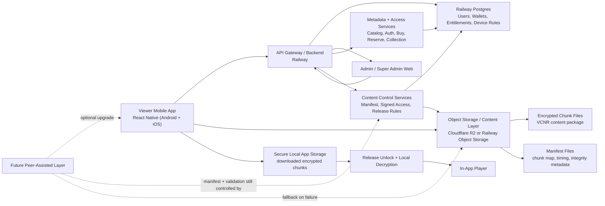

# Production Mobile Architecture

## What "Egress" Means

Egress means data leaving your server or storage and going out to users or other systems.

Examples:

- If a viewer downloads a 5 GB movie package from your storage, that 5 GB is egress.
- If your backend sends a small JSON API response to the mobile app, that is also egress, but very small.
- If your app uploads a file into your storage, that is ingress, not egress.

Why egress matters:

- API egress is usually small and not a major cost.
- Movie/content delivery egress is usually the biggest cost.
- So the app/API server and the content-download server should not be treated as the same thing.

## Recommended Production Split

### App Layer

- Mobile app: React Native viewer app for Android and iOS
- Backend API: Railway
- Database: Railway Postgres

### Content Layer

- Encrypted movie chunks: object storage
- Recommended primary target: Cloudflare R2
- Alternative demo-first target: Railway Object Storage

### Delivery Modes

1. Server-only mode first
2. Peer-assisted mode later
3. Server remains fallback even after peer-assisted mode is added

## Production-Ready Architecture Diagram

## Main Runtime Flow

### Server-Only Mode

1. Viewer logs into mobile app
2. Mobile app talks to Railway backend
3. Backend checks user, wallet, purchase state, release rules, and device rules
4. Backend returns catalog data and permissioned content access
5. Mobile app downloads encrypted chunks from object storage
6. App stores encrypted chunks in app-managed local storage
7. After release date/time and passcode availability, app unlocks and decrypts locally
8. Playback happens inside the app player

### Peer-Assisted Mode With Server Fallback

1. Backend still remains source of truth
2. Backend still controls manifest and entitlement
3. App first tries approved peer-assisted chunk download
4. Each chunk is verified against manifest/integrity data
5. If peer delivery is slow or fails, app falls back to server/object storage
6. Local decryption and playback remain the same

## Core Backend Services

### 1. Auth Service

- login
- token refresh
- session control
- optional device registration

### 2. Catalog Service

- upcoming
- new released
- reserved
- wish to watch
- my collection
- movie details

### 3. Commerce Service

- reserve now
- buy now
- wallet deduction
- entitlement creation
- refund/adjustment rules

### 4. Content Access Service

- content uploaded check
- delivery start datetime check
- release datetime check
- release passcode availability check
- signed manifest access
- signed chunk access

### 5. Device / Session Service

- allowed device count
- linked devices
- session/device validation
- optional forced logout or block rules

## Storage Design

### Database Stores

- users
- wallet balances
- purchase / reservation records
- movie metadata
- release timing
- device mappings
- entitlement state
- audit logs

### Object Storage Stores

- encrypted chunk files
- content manifests
- optional poster/trailer/gallery assets

Recommended path shape:

- `/titles/{title_id}/content/manifest.json`
- `/titles/{title_id}/content/chunks/...`

## Security Design

- Never expose release passcode early
- Keep content encrypted at rest in object storage
- Download only encrypted chunks
- Decrypt only inside app
- Store downloaded content inside app-managed local storage
- Use short-lived signed access where possible
- Keep entitlement checks in backend, not in app only

## Why This Is Cost-Efficient

- Railway handles API + DB well
- Large content bytes should not be served directly from Railway app service
- Object storage is better for large encrypted content distribution
- Server-only mode is simplest and safest first release
- Peer-assisted mode can later reduce storage-origin delivery bandwidth without removing server fallback

## Recommended Deployment For Your Case

### Demo / Testing

- React Native mobile app
- Railway backend
- Railway Postgres
- Railway Object Storage or Cloudflare R2

### Production Direction

- React Native mobile app
- Railway backend
- Railway Postgres
- Cloudflare R2 for encrypted chunks
- Signed content access controlled by backend
- Peer-assisted layer only after server-only delivery is proven stable
